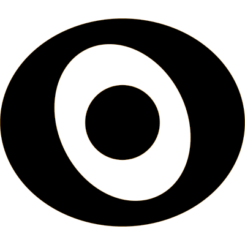

# Uninode® Suite

Uninode® Suite consists of these parts
* 
**Uninode®** is a framework for global type definitions and object identities, like Unicode for objects. 

* **Edgescript®** is a general purpose scripting language, integrated with Uninode®
* **UNQL** is Uninode® Query Language, for querying data sources using Uninode® and Edgescript®
* **Nodelab** is a client and server framework for visualization and analysis, using Uninode®, Edgescript® and UNQL
* **Unizone** is a set of standard Uninode® and Edgescript® definitions
* **Powerpilot** is software for financial analysis, based on Nodelab
* **Attentics** is the study of and AI analytics software for attention
* **Intentics** is the study of and AI analytics software for intention
* **Studiolab®** is <a href="https://patents.google.com/patent/US9378718B1/en" target="_blank">patented</a> music composing software, integrated with Uninode®, Edgescript® and Intentics
* **Net Daler** is a special purpose currency

<table>
  <tr>
    <td></td>
    <td></td>
    <td></td>
    <td></td>
    <td></td>
  </tr>
    <tr>
    <td>Uninode®</td>
    <td>Edgescript®</td>
    <td>UNQL</td>
    <td>Nodelab</td>
    <td>Studiolab®</td>
  </tr>
</table>

Uninode® Suite is currently a proprietary framework, owned by 
<a href="http://www.demagic.com" target="_blank">Demagic AB</a>, and used in various 
Java, Javascript and iOS projects.

<a href="https://trademarks.justia.com/780/37/uninode-78037205.html" target="_blank">Uninode®</a>,
<a href="https://trademarks.justia.com/858/04/edgescript-85804038.html" target="_blank">Edgescript®</a> and
<a href="https://trademarks.justia.com/783/92/studiolab-78392947.html" target="_blank">Studiolab®</a> 
are registered US trademarks.

Associated domains include
<a href="https://uninode.org" target="_blank">uninode.org</a>,
<a href="https://uninode.com" target="_blank">uninode.com</a>,
<a href="https://uninode.net" target="_blank">uninode.net</a>,
<a href="https://edgescript.org" target="_blank">edgescript.org</a>,
<a href="https://edgescript.com" target="_blank">edgescript.com</a>,
<a href="https://edgescript.net" target="_blank">edgescript.net</a>,
<a href="https://unql.org" target="_blank">unql.org</a>,
<a href="https://unql.com" target="_blank">unql.com</a>,
<a href="https://nodelab.org" target="_blank">nodelab.org</a>,
<a href="https://nodelab.com" target="_blank">nodelab.com</a>,
<a href="https://nodelab.net" target="_blank">nodelab.net</a>,
<a href="https://unizone.org" target="_blank">unizone.org</a>,
<a href="https://powerpilot.com" target="_blank">powerpilot.com</a>,
<a href="https://attentics.com" target="_blank">attentics.com</a>,
<a href="https://intentics.com" target="_blank">intentics.com</a>,
<a href="https://studiolab.eu" target="_blank">studiolab.eu</a> and
<a href="https://www.daler.net" target="_blank">daler.net</a>
